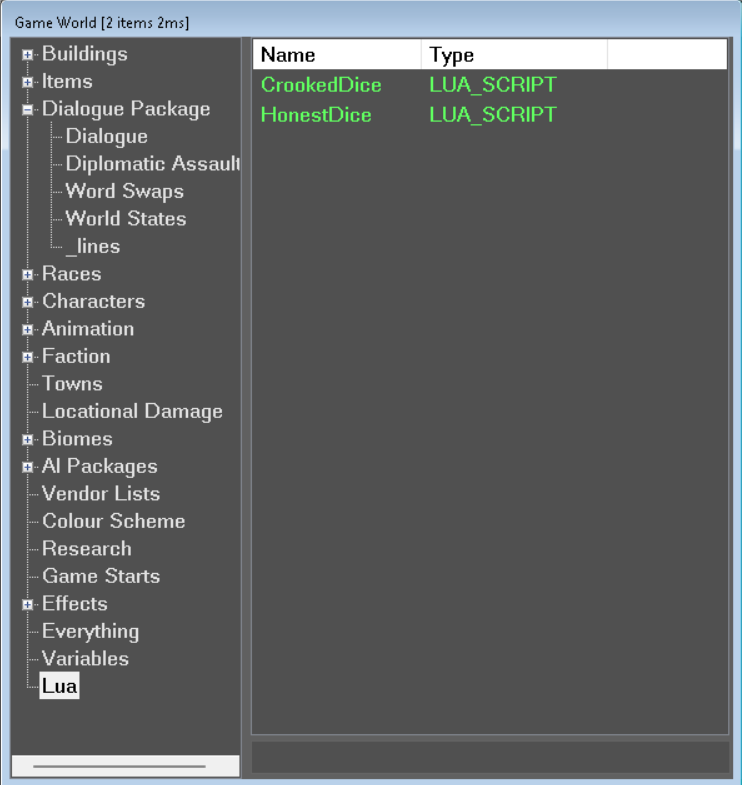
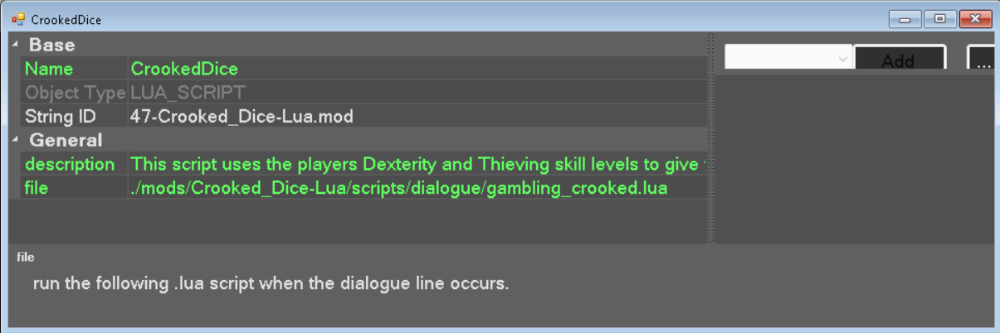
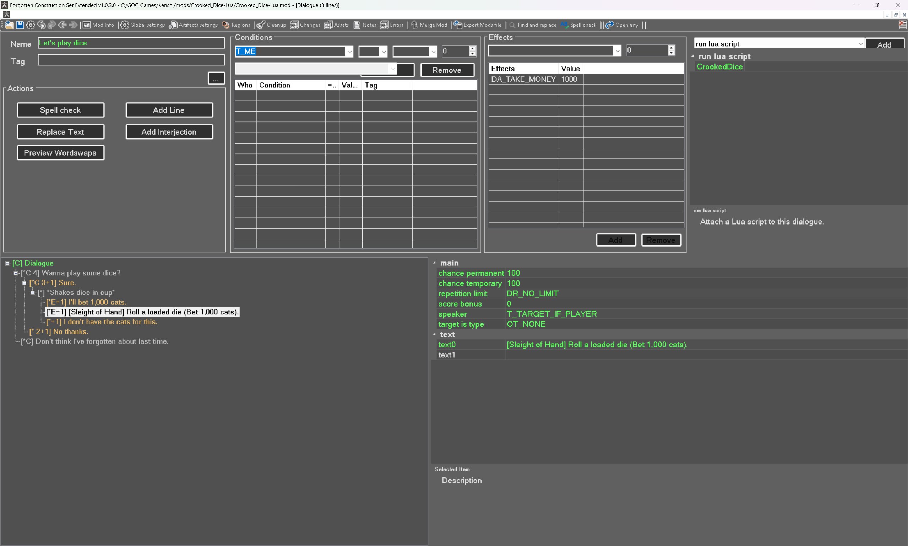
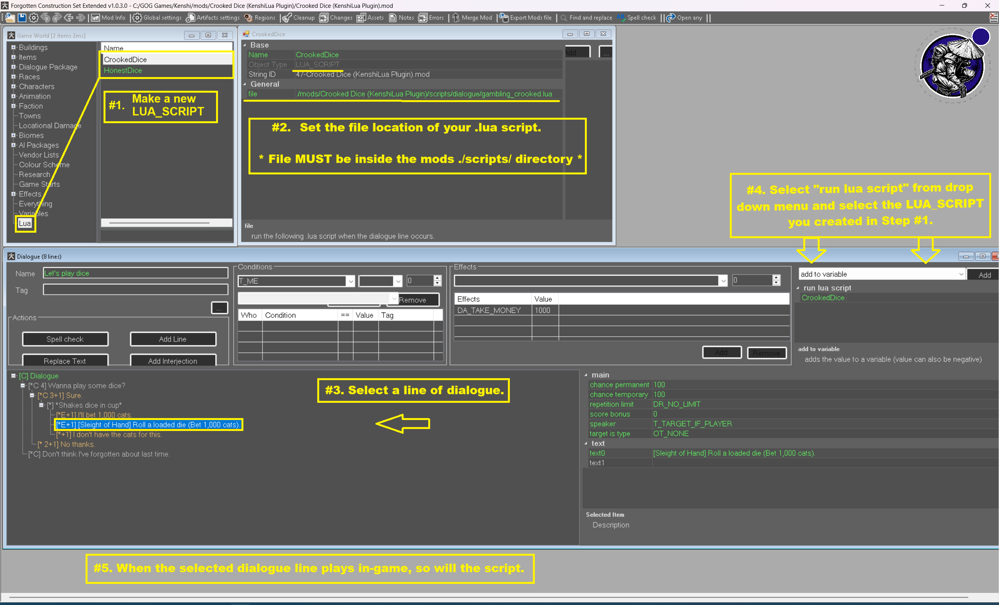

# DialogueScriptingBridge Guide

The **`DialogueScriptBridge`** is a bridge subsystem within KenshiLuaJIT that links Kenshi's Forgotten Construction Set (FCS) dialogue system directly to external Lua scripts. This allows modders to execute custom Lua scripts whenever specific dialogue lines play in-game.

---

## 1. Overview & Architecture

When a dialogue line is uttered in Kenshi, the game calls `Dialogue::_doActions(thisptr, dialogLine)`. KenshiLuaJIT hooks this method via `DialogueScriptBridge`:

```
+------------------+       Dialogue Played       +------------------------+
| Kenshi Engine    | --------------------------> | Dialogue::_doActions   |
+------------------+                             +------------------------+
                                                             |
                                                       (Hooked Call)
                                                             v
                                                 +------------------------+
                                                 | DialogueScriptBridge   |
                                                 +------------------------+
                                                             |
                                      Reads "run lua script" | Reference
                                                             v
                                                 +------------------------+
                                                 | LUA_SCRIPT GameData    |
                                                 | (Type 322, file field) |
                                                 +------------------------+
                                                             |
                                       Resolves path & sets  | globals
                                                             v
                                                 +------------------------+
                                                 | Executes .lua Script   |
                                                 | currentDialogue        |
                                                 | currentDialogueLine    |
                                                 +------------------------+
```

### Key Execution Steps:
1. **Hook Interception**: When `Dialogue::_doActions` fires, `DialogueScriptBridge(Dialogue* thisptr, DialogLineData* dialogLine)` is invoked.
2. **GameData Reference Lookup**: Inspects `dialogLine->data` for reference lists labeled `"run lua script"`.
3. **Script Item Resolution**: For each reference found, resolves the target `GameData` item of type `322` (`LUA_SCRIPT`) and extracts its `"file"` string attribute.
4. **Path Resolution**: `ScriptLoader` resolves the relative file path to the mod's `scripts/` directory.
5. **Global Injections**: Sets two transient global variables in the Lua state:
   - `currentDialogue` (`Dialogue*`)
   - `currentDialogueLine` (`DialogLineData*`)
6. **Sandboxed Execution**: Executes the target `.lua` script in a sandboxed environment.
7. **Cleanup**: Resets `currentDialogue` and `currentDialogueLine` back to `nil` after script completion to prevent state pollution.

---

## 2. FCS & FCS Extended Setup

To bind Lua scripts to dialogue lines in the Forgotten Construction Set (FCS), you must use **FCS Extended**:
- [FCS Extended on GitHub](https://github.com/BFrizzleFoShizzle/FCS_extended)
- [FCS Extended on Nexus Mods](https://www.nexusmods.com/kenshi/mods/1825)

### 1. `LUA_SCRIPT` Item Type Definition
Using `fcs.def` with FCS Extended (with KenshiLua support enabled), a new item type is registered in FCS:
- **Item Type Name**: `LUA_SCRIPT`
- **Enum Value**: `322`

### 2. Creating a `LUA_SCRIPT` Entry
1. Open FCS Extended with your `.mod` file active.
2. In the **GameWorld** window, navigate to any item category or create/edit a `DIALOGUE`, `DIALOGUE_LINE`, or `WORD_SWAP` item.
3. You will find a new item category available in the GameWorld tree named **"Lua"**.
4. Right-click and create a **New Item** under the "Lua" category (which creates a `LUA_SCRIPT` object).



5. A `LUA_SCRIPT` object contains two fields:
   - **`description`**: A text field for notes explaining what the script does.
   - **`file`**: A file reference field. Clicking this opens a file open dialog allowing you to select the `.lua` script within your mod's `scripts/` directory.



### 3. Attaching Script to a Dialogue Line
1. Open the target **DIALOGUE** or **DIALOGUE_LINE** in FCS Extended.
2. In the dialogue editor (upper right combo box / reference section), select the **`run lua script`** option.
3. Click to add a reference and select one of the `LUA_SCRIPT` items you created.



4. Save your `.mod` file.

### 4. Complete FCS Workflow Diagram
Below is an annotated overview of the entire FCS dialogue scripting setup process:



---

## 3. Directory & File Conventions

Kenshi organizes mod files under the standard path:
```text
./Kenshi/mods/<mod_name>/
```

When using KenshiLua, all Lua scripts **must** reside inside the `scripts` subdirectory of your mod:

```text
./Kenshi/mods/<mod_name>/scripts/
```

### Recommended Directory Structure

```text
./Kenshi/mods/examplemod/
├── examplemod.mod
└── scripts/
    ├── init/
    │   └── 00_startup.lua        -- Executed automatically on startup (main menu load)
    └── dialogue/
        ├── guard_bribe.lua       -- Dialogue script for guard bribe line
        ├── recruit_custom.lua    -- Dialogue script for custom recruit line
        └── quest_trigger.lua     -- Dialogue script triggering a world state/quest
```

### Script Execution Timing
- **`scripts/init/*.lua`**: All `.lua` files in `scripts/init/` are loaded and executed as soon as KenshiLua initializes (at the main menu, before loading a save game). Use this for registering custom event callbacks, global variables, or helper functions.
- **`scripts/dialogue/*.lua`**: Recommended directory for scripts triggered via `run lua script` in dialogue. They run dynamically whenever the linked dialogue line is executed in-game.

---

## 4. In-Game Runtime Environment

During the execution of a dialogue script, the following globals are made available:

| Global Variable | Type | Description |
| :--- | :--- | :--- |
| `currentDialogue` | [`Dialogue*`](file:///c:/Users/Genpretz/Desktop/Projects/KenshiLuaJIT/src/Bindings/DialogueBinding.h) | Active Kenshi `Dialogue` instance. |
| `currentDialogueLine` | [`DialogLineData*`](file:///c:/Users/Genpretz/Desktop/Projects/KenshiLuaJIT/src/Bindings/DialogLineDataBinding.h) | Active `DialogLineData` instance being processed. |

### Example Lua Script (`scripts/dialogue/guard_bribe.lua`)

```lua
-- Guard Bribe Script
-- Triggered via 'run lua script' reference on a dialogue line

if not currentDialogue or not currentDialogueLine then
    print("[Guard Bribe] Warning: Dialogue context missing.")
    return
end

-- Retrieve speaker and target characters from currentDialogue
local speaker = currentDialogue.speaker -- Character object
local target = currentDialogue.target   -- Character object

if speaker and target then
    local speakerName = speaker:getName()
    local targetName = target:getName()
    
    print(string.format("[DialogueScript] %s is speaking to %s", speakerName, targetName))
    
    -- Perform custom Lua logic (e.g., check player money, modify stats, spawn items)
    local playerFaction = target.faction
    if playerFaction then
        print("[DialogueScript] Target Faction: " .. tostring(playerFaction.name))
    end
end
```

---

## 5. Diagnostics & Troubleshooting

KenshiLua provides a built-in diagnostic function to inspect and verify all `run lua script` references registered in memory across all active mod `GameData` items.

### Running Diagnostic Scan in Lua
You can call `kenshi.checkLuaScriptReferences()` from the debug console or an `init` script:

```lua
local report = kenshi.checkLuaScriptReferences()
print(report)
```

### Example Diagnostic Output
```text
--- Scanning GameData for 'run lua script' references ---
Total GameData items in mainList: 14205

- Item Type: 4 ("1534-gamedata.mod" / "Guard Bribe Line 1")
    Reference ID: "322-my_mod.mod"
      -> Lua script file: "dialogue/guard_bribe.lua"

Total items with 'run lua script' references: 1
--- Scan Complete ---
```

### Common Issues & Checklist
1. **Script Path Errors**: Ensure the `.lua` file path in the `LUA_SCRIPT` `file` field is relative to `./Kenshi/mods/<mod_name>/scripts/`.
2. **Missing FCS Extended Config**: Ensure FCS Extended is configured properly with `fcs.def` containing `LUA_SCRIPT` (Type ID `322`).
3. **Nil Globals outside Dialogue**: `currentDialogue` and `currentDialogueLine` are **only** valid during the synchronous execution of the dialogue line script and are reset to `nil` immediately afterward.
