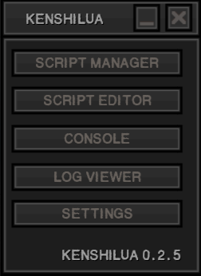
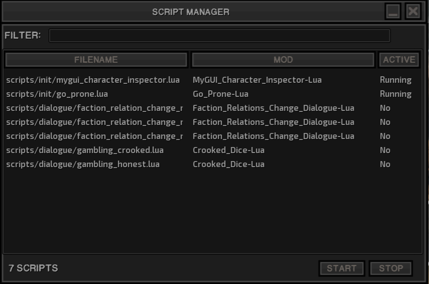
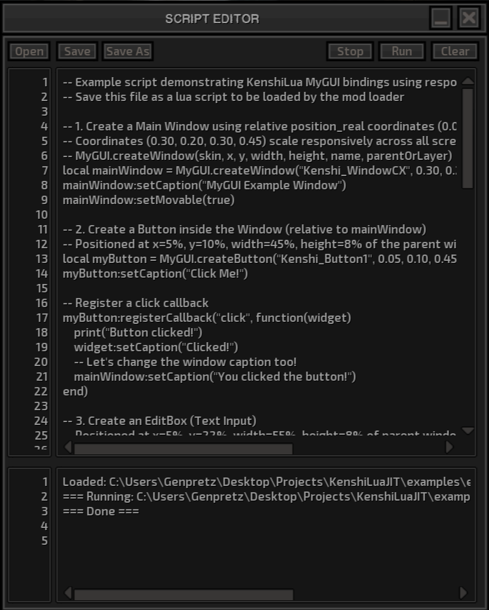
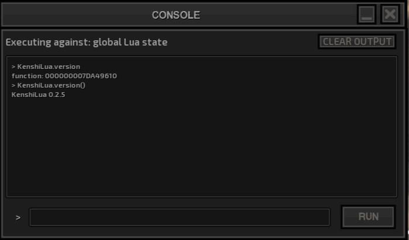
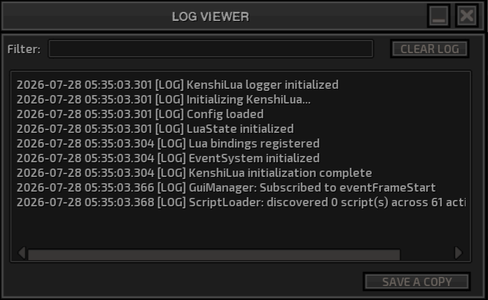
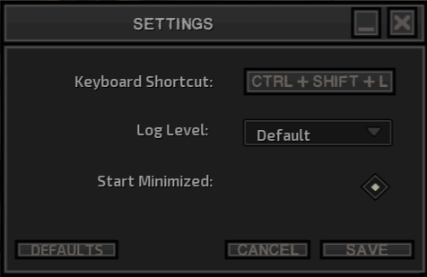

# KenshiLua In-Game GUI Guide

This document describes the usage, windows, features, and configuration options of KenshiLua's in-game User Interface (GUI).

---

## 1. Overview & Accessing the GUI

The KenshiLua in-game GUI can be accessed once the game's main menu has loaded by pressing the keyboard shortcut:

**`Shift + Ctrl + L`**

Opening the GUI displays the **KenshiLua Hub** window, which acts as the main navigation dashboard for accessing all other windows and tools.

The Hub includes direct access buttons to open:
* **Script Manager**
* **Script Editor**
* **Console**
* **Log Viewer**
* **Settings**

---

## 2. GUI Windows

### 2.1 Script Manager

The Script Manager lists all Lua scripts found within the directories of any currently active Kenshi mods.

* **Script Information**: Displays the script name, the associated mod name, and whether or not the script is currently running.
* **Controls**: Includes buttons to **Start** and **Stop** scripts on demand.
* **Filter Box**: A text input box at the top of the window allows you to filter the displayed list of scripts in real-time.

---

### 2.2 Script Editor

The Script Editor allows `.lua` files to be opened directly in-game, edited, saved, and executed.

* **Input Area**: A larger input text box for writing or editing Lua code.
* **Output Area**: A smaller output box that displays execution output, return values, or print statements from the script when run.
* **Controls**:
  * **Run**: Executes the current script content.
  * **Save**: Saves changes made to the `.lua` file.
  * **Clear Output**: Clears the text from the script editor's output box.

---

### 2.3 Console

The Console is designed for executing short, single Lua statements or quick debug snippets.

* **Input & Output**: Includes a command entry text box and a designated output box to display command execution results.
* **Controls**:
  * **Run**: Executes the entered Lua command.
  * **Clear Output**: Clears the console output history.

---

### 2.4 Log Viewer

The Log Viewer displays diagnostic and runtime log entries generated by Lua scripts via the `KenshiLua` logging functions:

* `KenshiLua.log(...)`
* `KenshiLua.logError(...)`
* `KenshiLua.logWarn(...)`
* `KenshiLua.logDebug(...)`

* **Log File Behavior**: The log file is automatically overwritten upon game startup.
* **Controls**:
  * **Save a Copy**: Saves a copy of the current log output to a separate persistent file.
  * **Clear Log**: Clears the current log display window.

---

### 2.5 Settings

The Settings window provides configuration options for customization and debugging preferences.

* **GUI Hotkey**: Customize the keyboard shortcut used to open and toggle the KenshiLua GUI.
* **Log Level**: Adjust the log filtering verbosity level (e.g. Debug, Info, Warn, Error).
* **Start Minimized**: Enabled by default. When enabled, KenshiLua remains hidden until activated via the hotkey. Disabling this option makes the KenshiLua Hub window visible automatically on startup.
* **Hot-Reloading**: Option to enable automatic hot-reloading of Lua scripts when files are modified on disk. *(Note: This option is present in-game but not visible in the screenshot above; the image will be updated in a future release.)*
* **Controls**:
  * **Save**: Saves changes to the configuration file.
  * **Defaults**: Resets all settings back to default values.

---

## 3. Miscellaneous Notes

* **Theme Integration**: KenshiLua's interface uses the game's native MyGUI skin engine. It automatically inherits and adapts to whatever UI theme mod is installed in Kenshi.
* **Minimize & Edge Hide**: Each window has a minimize button that toggles MyGUI's "edge hide" attribute, allowing windows to dock/slide off-screen when not actively in use.
* **Window Positioning & Docking**: The KenshiLua Hub window is locked to the upper-right corner of the screen by default. All other windows can be dragged and repositioned freely.
* **Layout Files**: Each window's UI structure is defined by an associated MyGUI `.layout` file located in the release distribution under `./kenshilua/gui/`.

---

## 4. Known Issues

> [!WARNING]
> **Output Buffer Conflict**: If the Log Viewer (or Console) and the Script Editor are open simultaneously, the output from the Script Editor may occasionally bleed into or appear in the Log Viewer/Console output window.
